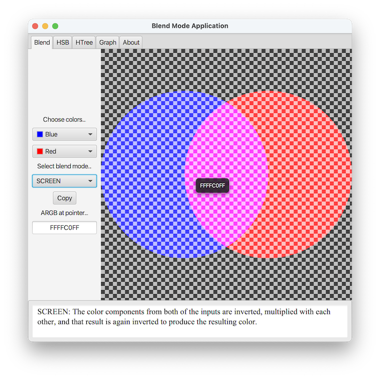

# Modular Project

Project *modular* is a simple framework that provides a home for `Modular` JavaFX applications. Applications that implement the `Modular` interface can easily be added to the `ModularHome` application.

To run the program from the command line, type:

    mvn clean javafx:run

## Blend Mode Application

A `Modular` JavaFX application with controls to select colors and examine the effect of the selected JavaFX [`BlendMode`](https://openjfx.io/javadoc/17/javafx.graphics/javafx/scene/effect/BlendMode.html). A similar example is discussed [here](https://stackoverflow.com/q/70085482/230513); more [here](https://stackoverflow.com/search?tab=votes&q=%5bjavafx%5d%20BlendMode).

## HSB Application

A `Modular` JavaFX application with controls that select a color and adjust the hue, saturation and brightness of a color swatch in the [`HSB`](https://en.wikipedia.org/wiki/HSL_and_HSV) color model.

## HTree Application 

A `Modular` JavaFX application that displays an [`HTree`](https://en.wikipedia.org/wiki/H_tree) along with control for depth, stroke, color and animation.

## Modular Arithmetic Graph

This `Modular` JavaFX application renders chords connecting points on a circle. Patterns emerge as the controls are adjusted interactively. The project was inspired by [_Times Tables, Mandelbrot and the Heart of Mathematics_](https://www.youtube.com/watch?v=qhbuKbxJsk8). Typical images produced by the application resemble the ones shown [here](https://github.com/Tonumoy/Modular-Arithmetic-on-a-Circle-in-Python).

